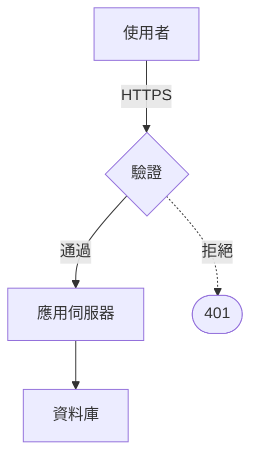

# Authoring open-doc pages

This skill is the **technical reference** for everything inside `docs/<id>/index.tsx`. It owns no workflow:

- `create-doc` owns "draft a new document" — it asks the scoping questions, then delegates the *how* to this skill.
- Any ad-hoc edit (fix a table, retitle a section, adjust margins) should also read this first.

## Primitive references

Read the matching reference **before** using a primitive:

| Primitive | Read before | File |
| --- | --- | --- |
| `design` const + `var(--od-*)` tokens | writing any new document | `references/design-system.md` |
| `flow()` auto-pagination | any body content (the default) | `references/pagination.md` |
| Vertical budget (fixed pages) | laying out a cover or divider by hand | `references/pagination.md` |
| Tables, stat rows, inline charts | rendering data of any kind | `references/tables-and-charts.md` |
| Assets + `<ImagePlaceholder>` | importing images or leaving a placeholder | `references/assets.md` |
| Footnotes, `<Figure>`, `<Ref>`, `<DataTable>` | any note, numbered figure, cross-reference, or `.csv` | `references/long-form.md` |

## Themes

If `themes/<id>.md` exists at the project root and the document is meant to follow it, **the theme file overrides the defaults in this skill** — its palette, typography, page setup, and paste-ready components are authoritative. Read the theme file end-to-end before applying anything else here, and set `meta.theme: '<id>'` so the document back-links to it (chip on the document card, listing on `/themes/<id>`).

Themes are produced by the `create-theme` skill and are pure documentation: copy the `design` const and the Title / Footer / Table components straight into the document. `mode: dark` in a theme's frontmatter applies to its cover, not to body pages — anything that prints stays light.

## Hard rules

- Put the document under `docs/<kebab-case-id>/`.
- Entry is `docs/<id>/index.tsx`. Images/fonts go under `docs/<id>/assets/`.
- Do **not** touch `package.json`, `open-doc.config.ts`, or other documents.
- Do not add dependencies. Only `react`, `@open-document/core`, and standard web APIs are available.
- A document is **one `index.tsx` plus `assets/`** — nothing else. Helper components and constants live inside `index.tsx`; no sibling `.tsx` files, no `README.md`.

## File contract

```tsx
// docs/<id>/index.tsx
import type { DocMeta, DocPage } from '@open-document/core';

const Cover: DocPage = () => <div>…</div>;
const Body: DocPage = () => <div>…</div>;

export const meta: DocMeta = {
  title: 'Q3 Infrastructure Review',
  subtitle: 'Platform team',
  author: 'Platform Engineering',
  pageSize: 'A4',
  orientation: 'portrait',
  createdAt: '2026-08-15T13:44:40.268Z',
};
export default [Cover, Body] satisfies DocPage[];
```

- `export default` is a **non-empty array of entries**. An entry is either a zero-prop React component (one fixed page) or a `flow(<>…</>)` section the framework paginates by measuring. Mix them freely — the usual shape is a fixed cover, a fixed contents page, then one flow section for the body.
- **Default to `flow()` for body content.** Hand-splitting prose into fixed pages produces documents where every heading starts a half-empty page. Read `references/pagination.md` before writing either kind.
- `meta.pageSize` is `'A4' | 'Letter' | 'A5' | 'Legal'` (default `'A4'`), `meta.orientation` is `'portrait' | 'landscape'` (default portrait). The same value drives the on-screen page, the `@page` size when printing, and the HTML export.
- `meta.createdAt` is an **ISO 8601 string literal** set once when the doc is scaffolded — the home page sorts on it. **Immediately before writing the file, run `node -e "console.log(new Date().toISOString())"` and paste the exact output.** It must stay a plain string literal (no `new Date(...)`): the framework reads it with a regex at build time, it never evaluates the module.

## Two ways to fill pages

```tsx
import { flow, type DocEntry } from '@open-document/core';

const Body = flow(
  <>
    <h1 style={h1}>1. Findings</h1>
    <p style={p}>…</p>
    <Table>…</Table>
  </>,
  { footer: Footer },
);

export default [Cover, Contents, Body] satisfies DocEntry[];
```

Each direct child of the fragment is one atomic block. Blocks never split across pages; headings glue to what follows them; a caption marked `data-od-keep-with-previous` stays with its figure. Everything else — where the breaks land, how many pages the section becomes, the running footer on each — is the framework's job.

Fixed `DocPage` components remain the right tool for the cover, a contents page, or a divider whose layout *is* the content. Those pages are subject to the vertical budget below.

## The page canvas

| Size | Portrait px (96dpi) | Text block at 76px margins |
| --- | --- | --- |
| A4 | 794 × 1123 | 642 × 971 |
| Letter | 816 × 1056 | 664 × 904 |
| A5 | 559 × 794 | 407 × 642 |
| Legal | 816 × 1344 | 664 × 1192 |

You design as if the viewport is literally the page in CSS pixels. The viewer only scales the whole sheet.

- Use **absolute pixel values** for `font-size`, padding, and positioning. No `rem`, no `vw`/`vh`, no `%` for type.
- Each page's root element must fill the sheet: `width: '100%'; height: '100%'`.
- Prefer inline `style={{ … }}`. Any CSS you load is global — scope classnames carefully.
- The viewer's CSS reset strips list markers. A `<ul>`/`<ol>` needs an explicit `listStyle: 'disc outside'` / `'decimal outside'` or it renders as unindented plain lines.
- **1pt ≈ 1.333px.** Body copy at 14px prints as ~10.5pt; anything under 12px (9pt) is uncomfortable in print, and under 10px (7.5pt) is unreadable.

### Print type scale (start here)

| Element | Size | Notes |
| --- | --- | --- |
| Cover title | 40–52px | Cover page only |
| H1 / section opener | 26–32px | One per section |
| H2 / subsection | 18–22px | |
| H3 / run-in heading | 15–17px | Often bold body size |
| Body | 13–15px | 1.5–1.65 line-height |
| Caption / table cell | 10–12px | Tables can go to 11px |
| Footnote / footer | 9–10px | |

### Margins

- Standard report: **72–96px** (19–25mm) on all four sides.
- Bound/printed double-sided: add ~24px to the inner edge.
- Running header/footer live **inside** the margin band, not in the text block.

## Vertical budget — for fixed pages only

A `DocPage` does **not** scroll or reflow: anything past the bottom edge is silently cropped, so do the math before writing JSX. (Inside a `flow()` section the framework measures for you — this arithmetic is exactly what it removes.)

**Usable height** = `page_height − 2 × margin` (A4 @ 76px margins → **971px**).
**Text height** = `font_size × line_height × line_count`. A paragraph that wraps to 4 lines counts as 4.
**Lines per page** ≈ `971 / (14 × 1.55)` ≈ **44 lines of body copy** on A4 — that is the whole budget for one page.

`references/pagination.md` has the worked example, the character-count estimate for how many lines a paragraph will wrap to, and the rules for where to split.

## Headings and the outline

The framework builds the document outline by scanning rendered pages for `h1`, `h2`, `h3` (or any element carrying `data-od-heading`). That outline powers the sidebar **and** `<TableOfContents />`.

- Use real `<h1>/<h2>/<h3>` elements for section titles, styled inline. Don't fake a heading with a `<div>` — it disappears from the outline and the TOC.
- Conversely, don't use heading tags for decorative text (a cover eyebrow, a stat label). Mark those `<div data-od-outline="skip">` if you must use a heading tag for styling reasons.
- **The cover title and the word "Contents" both carry `data-od-outline="skip"`.** A contents list that opens with the cover and lists itself reads as a bug.
- Override the listed text with `data-od-heading="Short title"` when the visible heading is long or contains markup.

## Footnotes, numbering, and data

Four primitives resolve themselves from the rendered pages, the same way the
contents list does. Read `references/long-form.md` before using any of them.

- **`<Footnote>`** — numbered by position, printed at the foot of the page its
  marker landed on, and its height is taken out of that page's budget before the
  packer breaks. On a fixed page, add `<Footnotes />` where they should print.
- **`<Figure caption id>`** — a numbered figure (or `kind="table"`), caption and
  content in one unbreakable block. `<ListOfFigures />` / `<ListOfTables />`
  build the lists.
- **`<Ref to="id" />`** — "Figure 3", plus the page when the target is elsewhere.
- **`<DataTable rows={…}>`** — a print-shaped table from an imported `.csv`.
- **`<Diagram chart={…} caption>`** — an architecture or flow drawing from an
  imported `.mmd`. Given a caption it numbers as a figure, like `<Figure>`.

`meta.labels` sets what they are called (`圖`, `表`) — the numbering itself is
structural.

## Diagrams

Write the drawing as Mermaid-flavoured text in `docs/<id>/<name>.mmd`, import
it, and hand it to `<Diagram>`:



```tsx
import { Diagram } from '@open-document/core';
import architecture from './architecture.mmd';

<Diagram chart={architecture} caption="請求路徑" width={420} />
```

It is compiled to SVG at build time and drawn with the document's own theme
variables, so it prints with the same ink and faces as the prose around it.
Never reach for an image of a diagram when the diagram can be written.

Supported: `flowchart`/`graph` with `TD` or `LR`; nodes as `A[box]`, `A(round)`,
`A([stadium])`, `A{decision}`, `A((circle))`; links `-->`, `---`, `-.->`, `==>`
with optional `|labels|`; chains `A --> B --> C`; `%%` comments. Anything else
in Mermaid's syntax — subgraphs, class diagrams, sequence diagrams — is not
supported, and a bad diagram fails the build with the line to fix.

Keep `width` inside the text block: a drawing wider than the column is a layout
fault, and `open-doc check` reports it as one.

## Table of contents

```tsx
import { TableOfContents } from '@open-document/core';

const Contents: DocPage = () => (
  <div style={page}>
    <h1 style={h1}>Contents</h1>
    <TableOfContents maxLevel={2} />
  </div>
);
```

Page numbers come from the scan, so they are always correct — **never hand-write a contents list**. The outline fills in after the first render pass; that is expected and it is resolved before PDF/HTML export serializes the pages.

## Page numbers, headers, footers

```tsx
import { useDocPageCount, useDocPageNumber } from '@open-document/core';

const Footer = () => {
  const page = useDocPageNumber();
  const total = useDocPageCount();
  return (
    <div style={{ position: 'absolute', left: 76, right: 76, bottom: 40, display: 'flex', justifyContent: 'space-between', fontSize: 10, color: 'var(--od-muted)' }}>
      <span>Q3 Infrastructure Review</span>
      <span style={{ fontVariantNumeric: 'tabular-nums' }}>{page} / {total}</span>
    </div>
  );
};
```

- **Never hardcode** `3 / 12`. Both hooks are 1-based and return `0` outside a page.
- Define the header/footer once as a local component and drop it into every page that needs it. Cover pages normally omit it.
- Footers are absolutely positioned inside the margin band; they do not consume the text block's vertical budget — but keep at least 24px of clearance between the last line of body copy and the footer.

## Starter template

```tsx
import { type DesignSystem, type DocMeta, type DocPage, useDocPageCount, useDocPageNumber } from '@open-document/core';

export const design: DesignSystem = {
  palette: {
    bg: '#ffffff',
    text: '#16181d',
    muted: '#6b7280',
    accent: '#1d4ed8',
    rule: '#e5e7eb',
  },
  fonts: {
    heading: '-apple-system, BlinkMacSystemFont, "Inter", system-ui, sans-serif',
    body: '-apple-system, BlinkMacSystemFont, "Inter", system-ui, sans-serif',
    mono: 'ui-monospace, "SF Mono", Menlo, monospace',
  },
  typeScale: { title: 44, h1: 28, h2: 20, h3: 16, body: 14, caption: 10 },
  margin: 76,
  leading: 1.55,
  radius: 6,
};

const page = {
  width: '100%',
  height: '100%',
  boxSizing: 'border-box' as const,
  padding: 'var(--od-margin)',
  background: 'var(--od-bg)',
  color: 'var(--od-text)',
  fontFamily: 'var(--od-font-body)',
  fontSize: 'var(--od-size-body)',
  lineHeight: 'var(--od-leading)',
  position: 'relative' as const,
};

const h1 = {
  fontFamily: 'var(--od-font-heading)',
  fontSize: 'var(--od-size-h1)',
  lineHeight: 1.2,
  fontWeight: 650,
  margin: '0 0 20px',
};

const Footer = () => {
  const n = useDocPageNumber();
  const total = useDocPageCount();
  return (
    <div
      style={{
        position: 'absolute',
        left: 'var(--od-margin)',
        right: 'var(--od-margin)',
        bottom: 40,
        display: 'flex',
        justifyContent: 'space-between',
        fontSize: 'var(--od-size-caption)',
        color: 'var(--od-muted)',
      }}
    >
      <span>Q3 Infrastructure Review</span>
      <span style={{ fontVariantNumeric: 'tabular-nums' }}>
        {n} / {total}
      </span>
    </div>
  );
};

const Cover: DocPage = () => (
  <div style={{ ...page, display: 'flex', flexDirection: 'column', justifyContent: 'flex-end' }}>
    <p style={{ fontSize: 12, letterSpacing: '0.16em', textTransform: 'uppercase', color: 'var(--od-accent)', margin: 0 }}>
      Platform Engineering
    </p>
    <h1 style={{ ...h1, fontSize: 'var(--od-size-title)', margin: '16px 0 12px' }}>
      Q3 Infrastructure Review
    </h1>
    <p style={{ color: 'var(--od-muted)', margin: 0 }}>August 2026</p>
  </div>
);

const Section: DocPage = () => (
  <div style={page}>
    <h1 style={h1}>1. Summary</h1>
    <p style={{ margin: '0 0 14px' }}>
      One paragraph per idea. Keep the page inside its vertical budget.
    </p>
    <Footer />
  </div>
);

export const meta: DocMeta = {
  title: 'Q3 Infrastructure Review',
  subtitle: 'Platform team',
  pageSize: 'A4',
  createdAt: '2026-08-15T13:44:40.268Z',
};
export default [Cover, Section] satisfies DocPage[];
```

## Editing an existing document

A finished report commonly runs 800–2000 lines. When you only need one page, **don't read the whole file** — locate it first:

```bash
grep -n ": DocPage = " docs/<id>/index.tsx
```

Then `Read` with `offset` + `limit` (~150 lines covers a page plus its helpers). Read the whole file only for cross-page work (renumbering sections, palette audit, reordering).

**Renumbering is a real cost.** If sections are numbered ("3.2 Findings"), inserting a page means editing every downstream heading. Prefer appending, or use unnumbered headings when the document is still churning.

## Prose discipline

A document is not a slide deck. Long-form copy is the point — but it still has rules:

- One idea per paragraph, 2–5 sentences. A paragraph over ~8 lines should be split.
- Lead each section with its conclusion, then the evidence. Readers skim reports.
- Tables beat bullet lists for anything with two or more dimensions.
- Cite numbers with their source and date inline (`Q3 billing export, 2026-08-01`) — a report that can't be traced gets ignored.
- Don't invent data. If a number must come from the user, leave `<ImagePlaceholder>` for a chart or an explicit `TODO:` marker in the copy and tell them at hand-off.

## Runtime behavior you get for free

- Home page lists every folder under `docs/` with a live thumbnail of page 1.
- Document view: vertical scroll of real-size pages, a left rail that switches between page thumbnails, the outline, and the document's assets, zoom (actual size / fit width / fit page), page counter, and fullscreen reading (`F`).
- Export PDF (print pipeline, correct `@page` size) and export HTML (self-contained, printable).
- Hot reload: edit `index.tsx` and the pages update live.
- **Assets panel** (`/assets` in the dev UI): upload, rename, and delete files in the global `assets/` folder or any document's `assets/` folder, with an "unused" badge and a copy-ready import line. Files you reference in source are what it scans, so an import you write by hand shows up there immediately.
- **Inspect mode** (the "Inspect" button, dev only): click any element on a page to edit its text in place — the change is written straight back into `docs/<id>/index.tsx` — or leave a note for the agent, which is stored as a `@doc-comment` marker and processed by the `apply-comments` skill.
- **Download menu** — PDF (true page size) and self-contained HTML.
- **Headless render** — `open-doc export <id> --format pdf|html|png` produces the same output from a script, and `open-doc check <id>` reports layout faults. Both drive the real viewer in a headless browser, so what they produce is what the Download menu produces.
- **Design panel** (the "Design" button in the document view, dev only): live-tweaks the `design` const — palette, fonts, type scale, margin, leading, radius — previewing on the real pages and writing the values back into `docs/<id>/index.tsx` on save.

### Writing for the inspector

Inspect mode edits the **literal text runs** of an element, and nothing else:

- A single run (`<p style={p}>copy</p>`) is editable in place.
- Mixed content (`<p>對外端點為 <code>/mcp</code>，另外自訂 …</p>`) is split into one field per run, with the markup shown as read-only chips. Each run is written back on its own, so the markup between them survives untouched.
- Text passed into a local helper (`<Td>FastMCP</Td>`) **is** editable: the inspector walks the React tree to the call site, which is where the words actually live. The helper's own definition stays untouched.
- Text produced by code (`{entry.text}`, a `map`, a hook) is refused — there is nothing literal to rewrite. Edit whatever feeds it.
- Every resolution is checked against the text on screen, and every write against the text the panel read. A mismatch is refused rather than guessed at, because the alternative is silently rewriting a different element.
- Comments anchor **inside** the clicked element, so self-closing elements (``, `<ImagePlaceholder />`) cannot host one; the user has to click the wrapper.

Practical consequence for authors: **put text in its own element**. `<Td>{value}</Td>` renders the same as `<Td>text</Td>` but only the latter can be edited from the page.

### Writing for the Design panel

The panel rewrites the `design` object in place through an AST edit, so keep its initializer in the shape it can read:

- `export const design: DesignSystem = { … }` (or `const design = …`) at module level, **object literal only** — string/number literals, nested objects. No spreads, no `satisfies` on the inner object, no computed keys, no values pulled from other constants.
- Values you want tweakable live *in* the const. A hex you inline into a style is invisible to the panel.
- If the document has no `design` const, saving from the panel creates one (and adds the `DesignSystem` type import). Anything the panel can't parse is reported in the panel instead of being silently overwritten.

## Check the layout before you call it done

You cannot see the pages you just wrote. The framework can:

```bash
open-doc check <id>     # every document if you omit the id; exits non-zero on errors
```

It renders each sheet at true page size and reports what a reader would call a
mistake — content clipped by the page edge, a blank sheet, a heading stranded at
the foot of a page, type too small to print, an image that never loaded — each
with the `line:column` in your source. Agents driving the MCP server call
`check_layout` for the same report, and `render_page` for a PNG of one sheet.

**Run it after writing a document and after any edit that changes how much text
is on a page.** The checklist below is what you reason about; `check` is what
confirms it.

## Self-review before finishing

- [ ] `open-doc check <id>` reports no errors.
- [ ] `docs/<id>/index.tsx` `export default`s a non-empty `DocEntry[]`, with body content in a `flow()` section rather than hand-split pages.
- [ ] Every page's root fills `100% × 100%` and sets `boxSizing: 'border-box'` with the margin as padding.
- [ ] **For every fixed page, sum (font_size × line_height × lines) + gaps + 2×margin ≤ page height.** If close, split — or move the content into the flow section. No `overflow: auto` escape hatches.
- [ ] No block inside a `flow()` section is taller than one page (a long table has to be split by hand — the framework never splits a block).
- [ ] Body type ≥ 13px; nothing on the page under 9px.
- [ ] Section titles are real `h1`/`h2`/`h3` elements, so the outline and TOC pick them up.
- [ ] Contents page uses `<TableOfContents />`, not a hand-written list.
- [ ] Page numbers come from `useDocPageNumber()` / `useDocPageCount()`.
- [ ] Document declares a top-level `export const design: DesignSystem` and pages consume `var(--od-*)`.
- [ ] Tables have a header row, aligned numerals (`fontVariantNumeric: 'tabular-nums'`), and fit the text block width.
- [ ] Numbers that refer to other things — figures, tables, notes, pages — come from `<Ref>` / `<Figure>` / `<Footnote>`, never typed in.
- [ ] Any data that exists as a file is imported, not retyped into JSX.
- [ ] All imported assets exist on disk (`docs/<id>/assets/`, or root `assets/` via `@assets/...`).
- [ ] Every `<ImagePlaceholder>` marks a real image the user must supply — not decorative filler.
- [ ] Nothing outside `docs/<id>/` was edited.

## Anti-patterns

- ❌ Overflowing the page. Cropped content is invisible — split instead.
- ❌ `overflow: auto` / `scroll` / `hidden` to "fit" more. The sheet doesn't scroll; you've hidden the bug.
- ❌ Shrinking body type below 13px or margins below 60px to cram content in.
- ❌ Hand-written contents lists or hardcoded page numbers — they go stale the moment a page is added.
- ❌ "See Figure 3 on page 12" written by hand, or a figure caption numbered `Figure 3` in the copy. Use `<Ref>` and `<Figure>`.
- ❌ Retyping a CSV the user already has into a JSX table.
- ❌ Fake headings (`<div>` styled like a title) — they vanish from the outline.
- ❌ A slide-deck voice: 6-word bullets and 100px type. This is a document.
- ❌ Tables built from `%` widths that overflow the text block, or with more than ~7 columns on portrait A4.
- ❌ Installing packages, editing `package.json` / `open-doc.config.ts` / other documents.
- ❌ Inventing data, sources, or citations.
